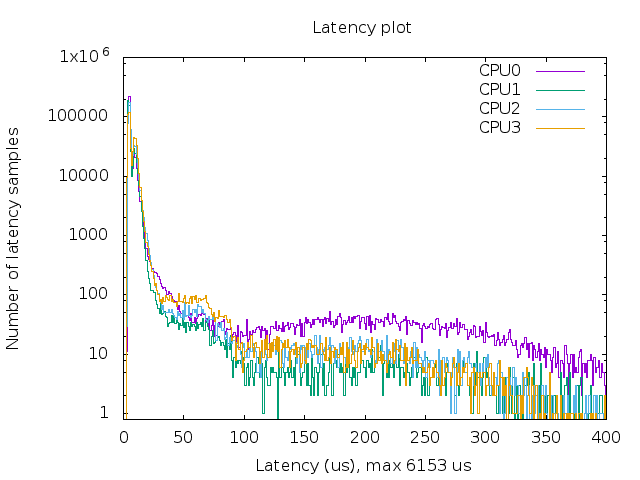
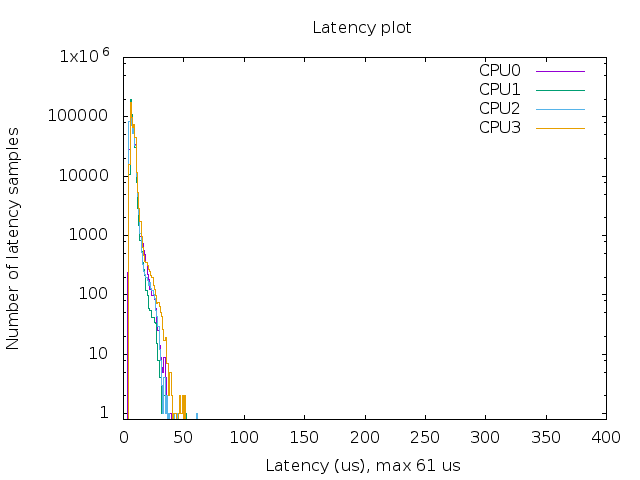

# Ubuntu-RT-UP-Board
An Ubuntu UP board Real time 4.4.86 kernel.

The UP board patches is modify by https://github.com/emutex/meta-up-board/tree/krogoth to work with 4.4.86

## @dicarlo236 help me a lot.

Support:
* GPIO
* LEDs
* UART
* SPI
* I2C

Unsupport:
* HDMI Audio
# Set up on UP board
## Install ubuntu
1. Download Ubuntu 16.04.6 ISO from the Ubuntu download page (works with desktop and server edition)

    http://releases.ubuntu.com/16.04/ubuntu-16.04.6-desktop-amd64.iso
    http://releases.ubuntu.com/16.04/ubuntu-16.04.6-server-amd64.iso

2. Burn the downloaded image on a USB stick. We suggest to use etcher for doing that. You can download it from:

    https://etcher.io

3. Insert the USB installer disk in a empty USB port and proceed with a normal Ubuntu installation.
## Get and replace the kernel
After install the ubuntu we need to get and replace the kernel for real time properties and the to be able to use the GPIO, PWM, SPI, I2C and uart. You can get the kernel by Download from release or build from source.
### Download from release
1. Download the `UP-board-4.4.86-rt99.deb.tar.xz` debian packages from release

    https://github.com/QiayuanLiao/Ubuntu-RT-UP-Board/releases/download/UP-board-4.4.86-rt99/UP-board-4.4.86-rt99.deb.tar.xz
2. Uncompress


### Build from source
1. Get the source:
    ```
    git clone git@github.com:QiayuanLiao/Ubuntu-RT-UP-Board.git
    cd Ubuntu-RT-UP-Board
    ```
2. Config the kernel:
    ```
    cp .config kernel
    cd kernel
    make menuconfig
    ```
    selet save and exit

3. Make the kernel
    ```
    make -j`nproc` && make -j`nproc` bindeb-pk
    ```
Then you will get:

```
linux-firmware-image-4.4.86-rt99_4.4.86-rt99-1_amd64.deb
linux-headers-4.4.86-rt99_4.4.86-rt99-1_amd64.deb
linux-image-4.4.86-rt99_4.4.86-rt99-1_amd64.deb
linux-libc-dev_4.4.86-rt99-1_amd64.deb
```

### Replace the kernel
1. Copy the debian packages to UP board

2. Remove all the generic installed kernel
    ```
    sudo apt-get autoremove --purge 'linux-.*generic'
    ```
3. Go to the file of debian packages and install the kernel:
    ```
    sudo dpkg -i linux-*.deb
    ```
4. Reboot
    ```
    sudo reboot
    ```
5.  Verify that the kernel is indeed installed by typing
    ```
    uname -v
    ```
    you should get
    ```
    #1 SMP PREEMPT RT xxxxxxxx
    ```

## Config and Test
### Config and test HAT device
1. Check if there are two SPI device
    ```
    ls /dev/spidev*
    ```
    you should get:
    ```
    /dev/spidev2.0  /dev/spidev2.1
    ```

2. Enable the HAT functionality from userspace
    ```
    sudo add-apt-repository ppa:ubilinux/up
    sudo apt install upboard-extras
    sudo usermod -a -G gpio ${USER}
    sudo usermod -a -G leds ${USER}
    sudo usermod -a -G spi ${USER}
    sudo usermod -a -G i2c ${USER}
    sudo usermod -a -G dialout ${USER}
    sudo reboot
    ```
3. Go to the `/test` file run the `./blink.sh`
    ```
    cd test
    sh ./blink.sh
    ```
    then the green led of UP board will blink
4. For HAT test, check

    https://wiki.up-community.org/Pinou

### Real time test using latency plot under the stress
1. Install requirement
    ```
    sudo apt install rt-tests stress gnuplot
    ```
2. Go to the `/test` file and Run the RT test
    ```
    cd test
    sudo sh  ./rt-test.sh
    ```
    then you will get a latency plot




3. Analysis:
    * More sample on the left more good
    * More sample get together more good
    * The max latency more small more good(should under 100us)

# Build from generic kernel step by step
1. Get kernel from:

    https://git.kernel.org/pub/scm/linux/kernel/git/stable/linux.git/snapshot/linux-4.4.86.tar.gz

    and uncompress.
2. Get RT_PREEMPT patch from:

    https://mirrors.edge.kernel.org/pub/linux/kernel/projects/rt/4.4/older/patches-4.4.86-rt99.tar.xz
3. Get UP board patches from release

    https://github.com/QiayuanLiao/Ubuntu-RT-UP-Board/releases/download/UP-board-4.4.86-rt99/UP-borad-patches.tar.xz

4. Copy `patches-4.4.86-rt99.tar.xz` to `linux-4.4.86`, then patch:
    ```
    unxz -cd patches-4.4.86-rt99.tar.xz | patch -p1
    ```


5. Copy `UP-borad-patches.tar.xz` to `linux-4.4.86`, then patch:
    ```
    unxz -cd UP-borad-patches.tar.xz | patch -p1
    ```
6. Config and make